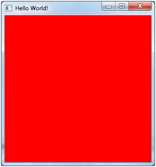

# İlk adımlar

Bu kitapta, 3B oyunların geliştirilmesinde yer alan temel teknikleri öğreneceğiz. Örneklerimizi Java'da geliştireceğiz ve Lightweight Java Game Library'i kullanacağız \([LWJGL](http://www.lwjgl.org/)\). LWJGL kütüphanesi, OpenGL gibi düşük seviyeli API'lere \ (Uygulama Programlama Arayüzü \) erişim sağlar.

LWJGL, OpenGL'i sarmallayan düşük seviyeli bir API'dir. Amacınız kısa sürede 3B oyunlar oluşturmaya başlamaksa, belki de \ [JmonkeyEngine \] gibi diğer alternatifleri de düşünmelisiniz. Bu düşük seviyeli API' yi kullanarak, sonuçları görmeden önce birçok kavramdan geçmeniz ve çok sayıda kod satırı yazmanız gerekecektir. Bunun avantajı, 3B grafikleri çok daha iyi anlamanız ve daha iyi kontrol edebilmenizdir.

Önceki paragraflarda belirtildiği gibi, bu kitap için Java'yı kullanacağız. Java 10' u kullanacağız, bu yüzden Java SDK' yı Oracle'ın sayfalarından indirmeniz gerekiyor. Sadece işletim sisteminize uygun yükleyiciyi seçin ve yükleyin. Bu kitap, Java dilini orta seviyede bildiğinizi varsayar.

Örnekleri çalıştırmak için istediğiniz Java IDE' yi kullanabilirsiniz. Java 10 için iyi bir desteğe sahip olan IntelliJ IDEA' yı indirebilirsiniz. Java 10 sadece 64 bit platformlar için mevcut olduğundan, IntelliJ' nin 64 bit sürümünü indirmeyi unutmayın. IntelliJ, buradan [https://www.jetbrains.com/idea/download/](https://www.jetbrains.com/idea/download/ "Intellij") indirebileceğiniz ücretsiz açık kaynak sürümü olan Topluluk Sürümü' nü sunar: .


Örneklerimizi inşaa etmek için [Maven](https://maven.apache.org/) kullanacağız. Maven zaten çoğu IDE' ye entegre edilmiştir ve içindeki çeşitli örnekleri doğrudan açabilirsiniz. Sadece bölüm örneğini içeren klasörü açın ve IntelliJ bunun bir maven projesi olduğunu algılar.


Maven, proje bağımlılıklarını (kullanmanız gereken kütüphaneleri \) yöneten ` pom.xml` \ (Proje Nesne Modeli \) adlı bir XML dosyasına ve derleme işlemi sırasında gerçekleştirilecek adımlara dayalı projeler oluşturur. Maven, konfigürasyon üzerinde toplanma prensibini takip eder, yani standart proje yapısına ve adlandırma kurallarına bağlı kalırsanız, konfigürasyon dosyasının kaynak dosyaların nerede olduğunu veya derlenmiş sınıfların nerede bulunması gerektiğini açıkça söylemesine gerek yoktur.

Bu kitap bir maven eğitseli olmak niyetinde değildir, bu yüzden ihtiyacınız olması durumunda lütfen web' deki bilgileri araştırın.  Kaynak kod klasörü, kullanılacak eklentileri tanımlayan ve kullanılan kütüphanelerin sürümlerini toplayan bir üst projeyi tanımlar.

LWJGL 3.1, projenin oluşturulma biçiminde bazı değişiklikler yaptı. Artık temel kod çok daha modüler ve dev bir monolitik jar dosyası kullanmak yerine kullanmak istediğimiz paketlerde daha seçici olabiliyoruz. Bu durum bir maliyet ile birlikte geliyor: Şimdi bağımlılıkları tek tek dikkatlice belirtmeniz gerekiyor. Ancak [bu sayfa] (https://www.lwjgl.org/download), sizin için pom dosyasını oluşturan özel bir komut dosyası içerir. Bizim durumumuzda, sadece GLFW ve OpenGL bağlamalarını kullanacağız. Pom dosyasının kaynak kodunu kontrol edebilirsiniz.

LWJGL platform bağımlılığı zaten platformunuz için yerel kütüphanelerin paketini açmakla ilgilenir, bu nedenle diğer eklentileri (`mavennatives`gibi) kullanmaya gerek yoktur. LWJGL platformunu yapılandıracak bir özellik ayarlamak için sadece üç profil oluşturmamız gerekiyor.Profiller; Windows, Linux ve Mac OS aileleri için bu özelliğin doğru değerlerini ayarlayacaktır.

```xml
    <profiles>
        <profile>
            <id>windows-profile</id>
            <activation>
                <os>
                    <family>Windows</family>
                </os>
            </activation>
            <properties>
                <native.target>natives-windows</native.target>
            </properties>                
        </profile>
        <profile>
            <id>linux-profile</id>
            <activation>
                <os>
                    <family>Linux</family>
                </os>
            </activation>
            <properties>
                <native.target>natives-linux</native.target>
            </properties>                
        </profile>
        <profile>
            <id>OSX-profile</id>
            <activation>
                <os>
                    <family>mac</family>
                </os>
            </activation>
            <properties>
                <native.target>natives-osx</native.target>
            </properties>
        </profile>
    </profiles>
```

Her proje içinde LWJGL platform bağımlılığı geçerli platform için profilde kurulan doğru özelliği kullanır.

```xml
        <dependency>
            <groupId>org.lwjgl</groupId>
            <artifactId>lwjgl-platform</artifactId>
            <version>${lwjgl.version}</version>
            <classifier>${native.target}</classifier>
        </dependency>
```

Bunun yanı sıra, her proje çalıştırılabilir bir .jar oluşturur \(java yazarak çalıştırılabilir bir -jar name\_of\_the\_jar.jar\). Bu, doğru değerlere sahip bir `MANIFEST.MF` dosyasına sahip bir jar oluşturan maven-jar-eklentisi kullanılarak gerçekleştirilir. Bu dosya için en önemli özellik, programın giriş noktasını ayarlayan `Main-Class` dır. Ayrıca, tüm bağımlılıklar söz konusu dosya için `Class-Path` özniteliğinde girdiler olarak ayarlanır. Başka bir bilgisayarda çalıştırmak için, ana jar dosyasını ve hedef dizinin altında bulunan lib jar' ını \ (tüm jar' lar dahil \) kopyalamanız yeterlidir.

LWJGL sınıflarını içeren jar dosyaları ayrıca yerel kütüphaneleri de içerir. LWJGL onları ayıklamak ve JVM' nin kütüphaneleri arayacağı yolu eklemekle ilgilenecektir.

Bölüm 1 kaynak kodu doğrudan LWJGL sitesindeki Başlarken örneğinden alıntıdır \([http://www.lwjgl.org/guide](http://www.lwjgl.org/guide)\). GUI kütüphanemiz olarak Swing veya JavaFX kullanmadığımızı göreceksiniz. Bunun yerine, GUI bileşenlerini \ (Pencere, vb.) ve \ olaylarını (tuşa basma, fare hareketleri, vb.) OpenGL içeriği ile işlemek için basitçe bağlayan  [GLFW] (www.glfw.org) kütüphanesini kullanıyoruz. LWJGL' nin önceki sürümleri özel bir GUI API' si sağlamıştı, ancak LWJGL 3 için GLFW tercih edilen pencereleme API' dır.

Örneklerin kaynak kodu çok iyi dokümanlaştırılmış ve açıktır, bu nedenle yorumları tekrar etmeyeceğiz.

Ortamınızı doğru bir şekilde kurduysanız, onu çalıştırabilmeniz ve kırmızı arka plana sahip bir pencere görebilmeniz gerekir.



**Bu kitabın kaynak kodu şu adreste yayınlanmaktadır: **[**GitHub**](https://github.com/lwjglgamedev/lwjglbook)**.**

