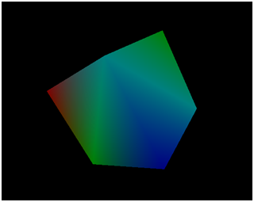
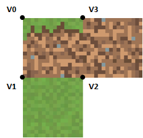
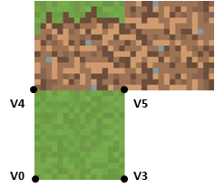

# Textures

## Create a 3D cube

In this chapter we will learn how to load textures and use them in the rendering process. In order to show all the concepts related to textures we will transform the quad that we have been using in previous chapters into a 3D cube. With the code base we have created, in order to draw a cube we just need to correctly define the coordinates of a cube and it should be drawn correctly.

In order to draw a cube we just need to define eight vertices.


So the associated coordinates array will be like this:

```java
float[] positions = new float[] {
    // VO
    -0.5f,  0.5f,  0.5f,
    // V1
    -0.5f, -0.5f,  0.5f,
    // V2
    0.5f, -0.5f,  0.5f,
    // V3
     0.5f,  0.5f,  0.5f,
    // V4
    -0.5f,  0.5f, -0.5f,
    // V5
     0.5f,  0.5f, -0.5f,
    // V6
    -0.5f, -0.5f, -0.5f,
    // V7
     0.5f, -0.5f, -0.5f,
};
```

Of course, since we have 4 more vertices we need to update the array of colours. Just repeat the first four items by now.

```java
float[] colours = new float[]{
    0.5f, 0.0f, 0.0f,
    0.0f, 0.5f, 0.0f,
    0.0f, 0.0f, 0.5f,
    0.0f, 0.5f, 0.5f,
    0.5f, 0.0f, 0.0f,
    0.0f, 0.5f, 0.0f,
    0.0f, 0.0f, 0.5f,
    0.0f, 0.5f, 0.5f,
};
```

Finally, since a cube is made of six faces we need to draw twelve triangles \(two per face\), so we need to update the indices array. Remember that triangles must be defined in counter-clock wise order. If you do this by hand, is easy to make mistakes. Always put the face that you want to define indices for in front of you. Then, identify the vertices and draw the triangles in counter-clock wise order.

```java
int[] indices = new int[] {
    // Front face
    0, 1, 3, 3, 1, 2,
    // Top Face
    4, 0, 3, 5, 4, 3,
    // Right face
    3, 2, 7, 5, 3, 7,
    // Left face
    6, 1, 0, 6, 0, 4,
    // Bottom face
    2, 1, 6, 2, 6, 7,
    // Back face
    7, 6, 4, 7, 4, 5,
};
```

In order to better view the cube we will change code that rotates the model in the `DummyGame` class to rotate along the three axes.

```java
// Update rotation angle
float rotation = gameItem.getRotation().x + 1.5f;
if ( rotation > 360 ) {
    rotation = 0;
}
gameItem.setRotation(rotation, rotation, rotation);
```

And that’s all. We are now able to display a spinning 3D cube. You can now compile and run your example and you will obtain something like this.


There is something weird with this cube. Some faces are not being painted correctly. What is happening? The reason why the cube has this aspect is that the triangles that compose the cube are being drawn in a sort of random order. The pixels that are far away should be drawn before pixels that are closer. This is not happening right now and in order to do that we must enable depth testing.

This can be done in the `Window` class at the end of the `init` method:

```java
glEnable(GL_DEPTH_TEST);
```

Now our cube is being rendered correctly!



If you see the code for this part of the chapter you may see that we have done a minor reorganization in the `Mesh` class. The identifiers of the VBOs are now stored in a list to easily iterate over them.

## Adding texture to the cube

Now we are going to apply a texture to our cube. A texture is an image which is used to draw the colour of the pixels of a certain model. You can think of a texture as a skin that is wrapped around your 3D model. What you do is assign points in the image texture to the vertices in your model. With that information OpenGL is able to calculate the colour to apply to the other pixels based on the texture image.


The texture image does not have to be the same size as the model. It can be larger or smaller. OpenGL will extrapolate the colour if the pixel to be processed cannot be mapped to a specific point in the texture. You can control how this process is done when a specific texture is created.

So basically what we must do, in order to apply a texture to a model, is assigning texture coordinates to each of our vertices. The texture coordinate system is a bit different from the coordinate system of our model. First of all, we have a 2D texture so our coordinates will only have two components, x and y. Besides that, the origin is setup in the top left corner of the image and the maximum value of the x or y value is 1.


How do we relate texture coordinates with our position coordinates? Easy, in the same way we passed the colour information. We set up a VBO which will have a texture coordinate for each vertex position.

So let’s start modifying the code base to use textures in our 3D cube. The first step is to load the image that will be used as a texture. For this task, in previous versions of LWJGL, the Slick2D library was commonly used. At the moment of this writing it seems that this library is not compatible with LWJGL 3 so we will need to follow another approach. We will use the LWJGL wrapper for the [stb](https://github.com/nothings/stb) library. In order to do that,  we need first to declare that dependency, including the natives in our `pom.xml` file.

```xml
<dependency>
    <groupId>org.lwjgl</groupId>
    <artifactId>lwjgl-stb</artifactId>
    <version>${lwjgl.version}</version>
</dependency>
[...]
<dependency>
    <groupId>org.lwjgl</groupId>
    <artifactId>lwjgl-stb</artifactId>
    <version>${lwjgl.version}</version>
    <classifier>${native.target}</classifier>
    <scope>runtime</scope>
</dependency>
```

One thing that you may see in some web pages is that the first thing we must do is enable the textures in our OpenGL context by calling `glEnable(GL_TEXTURE_2D)`. This is true if you are using the fixed-function pipeline. Since we are using GLSL shaders it is not required anymore.

Now we will create a new `Texture` class that will perform all the necessary steps to load a texture. First we need to load the image data into a `ByteBuffer`. The code is defined as this:

```java
private static int loadTexture(String fileName) throws Exception {
    int width;
    int height;
    ByteBuffer buf;
    // Load Texture file
    try (MemoryStack stack = MemoryStack.stackPush()) {
        IntBuffer w = stack.mallocInt(1);
        IntBuffer h = stack.mallocInt(1);
        IntBuffer channels = stack.mallocInt(1);

        URL url = Texture.class.getResource(fileName);
        File file = Paths.get(url.toURI()).toFile();
        String filePath = file.getAbsolutePath();
        buf = stbi_load(filePath, w, h, channels, 4);
        if (buf == null) {
            throw new Exception("Image file [" + filePath  + "] not loaded: " + stbi_failure_reason());
        }
    
        /* Get width and height of image */
        width = w.get();
        height = h.get();
     }
	 [... More next ....]
```
The first thing we do is to allocate some memory for the library to return the image data itself (a `ByteBuffer`), and the width and  height. Then we need to transform the `CLASSPATH` relative path for the image to an absolute path.

Then we call to the `stbi_load` method to actually load the image. It requires three parameters:

* `filePath`: The absolute path to the file. The stb library is native and does not understand anything about `CLASSPATH`. So, keep in mind that the resources, for the stb library, may be in the `CLASSPATH` but cannot be embeded into a JAR file.
* `width`:  Image width. This will be populated with the image width.
* `height`: Image height. This will be populated with the image height.
* `channels`: The image channels.
* `desired_channels`: The desired image channels. We pass 4 (RGBA).

One important thing to remember is that OpenGL, for historical reasons, requires that texture images have a size \(number of texels in each dimension\) of a power of two \(2, 4, 8, 16, ....\). Some drivers remove that constraint but it’s better to stick to it to avoid problems.

The next step is to upload the texture into the graphics card memory. First of all we need to create a new texture identifier. Each operation related to that texture will use that identifier so we need to bind it.

```java
// Create a new OpenGL texture 
int textureId = glGenTextures();
// Bind the texture
glBindTexture(GL_TEXTURE_2D, textureId);
```

Then we need to tell OpenGL how to unpack our RGBA bytes. Since each component is one byte in size we need to add the following line:

```java
glPixelStorei(GL_UNPACK_ALIGNMENT, 1);
```

And finally we can upload our texture data:

```java
glTexImage2D(GL_TEXTURE_2D, 0, GL_RGBA, decoder.getWidth(),
    decoder.getHeight(), 0, GL_RGBA, GL_UNSIGNED_BYTE, buf);
```

The `glTexImage2D` method has the following parameters:

* `target`: Specifies the target texture \(its type\). In this case: `GL_TEXTURE_2D`. 
* `level`: Specifies the level-of-detail number. Level 0 is the base image level. Level n is the nth mipmap reduction image. More on this later.
* `internal format`: Specifies the number of colour components in the texture.
* `width`: Specifies the width of the texture image.
* `height`: Specifies the height of the texture image.
* `border`: This value must be zero.
* `format`: Specifies the format of the pixel data: RGBA in this case.
* `type`: Specifies the data type of the pixel data. We are using unsigned bytes for this.
* `data`: The buffer that stores our data.

In some code snippets that you may find, you will probably see that filtering parameters are set up before calling the `glTexImage2D` method. Filtering refers to how the image will be drawn when scaling and how pixels will be interpolated. If filtering parameters are not set the texture will not be displayed. So before the `glTexImage2D` method you could see something like this:

```java
glTexParameteri(GL_TEXTURE_2D, GL_TEXTURE_MIN_FILTER, GL_NEAREST);
glTexParameteri(GL_TEXTURE_2D, GL_TEXTURE_MAG_FILTER, GL_NEAREST);
```

These parameters basically say that when a pixel is drawn with no direct one to one association to a texture coordinate it will pick the nearest texture coordinate point.

By this moment we will not set up filtering parameters. Instead we will generate a mipmap. A mipmap is a decreasing resolution set of images generated from a high detailed texture. These lower resolution images will be used automatically when our object is scaled.

In order to generate mipmaps we just need to set the following line \(in this case after the `glTexImage2D` method\):

```java
glGenerateMipmap(GL_TEXTURE_2D);
```

Finally we can free the memory for the raw image data itself:

```
stbi_image_free(buf);
```

And that’s all, we have successfully loaded our texture. Now we need to use it. As we said before we need to pass texture coordinates as another VBO. So we will modify our Mesh class to accept an array of floats, that contains texture coordinates, instead of the colour \(we could have colours and texture but in order to simplify it we will strip colours off\). Our constructor will be like this:

```java
public Mesh(float[] positions, float[] textCoords, int[] indices,
    Texture texture)
```

The texture coordinates VBO is created in the same way as the colour one. The only difference is that it has two components per position instead of three:

```java
vboId = glGenBuffers();
vboIdList.add(vboId);
textCoordsBuffer = MemoryUtil.memAllocFloat(textCoords.length);
textCoordsBuffer.put(textCoords).flip();
glBindBuffer(GL_ARRAY_BUFFER, vboId);
glBufferData(GL_ARRAY_BUFFER, textCoordsBuffer, GL_STATIC_DRAW);
glVertexAttribPointer(1, 2, GL_FLOAT, false, 0, 0);
```

Now we need to use the texture in our shader. In the vertex shader we have changed the second uniform parameter because now it’s a `vec2` \(we also changed the uniform name, so remember to change it in the `Renderer` class\). The vertex shader, as in the colour case, just passes the texture coordinates to be used by the fragment shader.

```glsl
#version 330

layout (location=0) in vec3 position;
layout (location=1) in vec2 texCoord;

out vec2 outTexCoord;

uniform mat4 worldMatrix;
uniform mat4 projectionMatrix;

void main()
{
    gl_Position = projectionMatrix * worldMatrix * vec4(position, 1.0);
    outTexCoord = texCoord;
}
```

In the fragment shader we must use those texture coordinates in order to set the pixel colours:

```glsl
#version 330

in  vec2 outTexCoord;
out vec4 fragColor;

uniform sampler2D texture_sampler;

void main()
{
    fragColor = texture(texture_sampler, outTexCoord);
}
```

Before analyzing the code let’s clarify some concepts. A graphics card has several spaces or slots to store textures. Each of these spaces is called a texture unit. When we are working with textures we must set the texture unit that we want to work with. As you can see we have a new uniform named `texture_sampler`. That uniform has a `sampler2D` type and will hold the value of the texture unit that we want to work with.

In the main function we use the texture `lookup` function named `texture`. This function takes two arguments: a sampler and a texture coordinate and will return the correct colour. The sampler uniform allow us to do multi-texturing. We will not cover that topic right now but we will try to prepare the code to add it easily later on.

Thus, in our `ShaderProgram` class we will create a new method that allows us to set an integer value for a uniform:

```java
public void setUniform(String uniformName, int value) {
    glUniform1i(uniforms.get(uniformName), value);
}
```

In the `init` method of the `Renderer` class we will create a new uniform:

```java
shaderProgram.createUniform("texture_sampler");
```

Also, in the `render` method of our `Renderer` class we will set the uniform value to 0. \(We are not using several textures right now so we are just using unit 0\).

```java
shaderProgram.setUniform("texture_sampler", 0);
```

Finally we just need to change the render method of the `Mesh` class to use the texture. At the beginning of that method we put the following lines:

```java
// Activate first texture unit
glActiveTexture(GL_TEXTURE0);
// Bind the texture
glBindTexture(GL_TEXTURE_2D, texture.getId());
```

We basically are binding the texture identified by `texture.getId()` to the texture unit 0.

Right now, we have just modified our code base to support textures. Now we need to setup texture coordinates for our 3D cube. Our texture image file will be something like this:


In our 3D model we have eight vertices. Let’s see how this can be done. Let’s first define the front face texture coordinates for each vertex.



| Vertex | Texture Coordinate |
| --- | --- |
| V0 | \(0.0, 0.0\) |
| V1 | \(0.0, 0.5\) |
| V2 | \(0.5, 0.5\) |
| V3 | \(0.5, 0.0\) |

Now, let’s define the texture mapping of the top face.



| Vertex | Texture Coordinate |
| --- | --- |
| V4 | \(0.0, 0.5\) |
| V5 | \(0.5, 0.5\) |
| V0 | \(0.0, 1.0\) |
| V3 | \(0.5, 1.0\) |

As you can see we have a problem, we need to setup different texture coordinates for the same vertices \(V0 and V3\). How can we solve this? The only way to solve it is to repeat some vertices and associate different texture coordinates. For the top face we need to repeat the four vertices and assign them the correct texture coordinates.

Since the front, back and lateral faces use the same texture we will not need to repeat all of these vertices. You have the complete definition in the source code, but we needed to move from 8 points to 20. The final result is like this.


In the next chapters we will learn how to load models generated by 3D modeling tools so we won’t need to define by hand the positions and texture coordinates \(which by the way, would be impractical for more complex models\).

## A brief note about transparencies

As you have seen, when we load an image, we retrieve the four RGBA components, which include the transparency level. But, if you load a texture with transparencies you may not see anything. In other to support that we need to enable blending.

This is done, by this fragment of code:

`glEnable(GL_BLEND);`

But just by enabling blending, transparencies still will not show up. We need also to instruct OpenGL about how the blending will be applied. This is done through the glBlendFunc method. For instance:

`glBlendFunc(GL_SRC_ALPHA, GL_ONE_MINUS_SRC_ALPHA);`

You can check an excellent explanation about the details of the different functions that can be applied [here]( https://learnopengl.com/Advanced-OpenGL/Blending)

Event after you have enabled blending and set up a function you may not see correct values for transparencies. The reason behind that is depth testing. When fragments are discarded using depth values, we can end up blending fragments with transparent values with the background, not with fragments that were behind them. This will result in wrong rendering artifacts.

In order to solve that there we need to draw first opaque objects and then render objects that have transparencies in decreasing depth order (far objects should be drawn first).