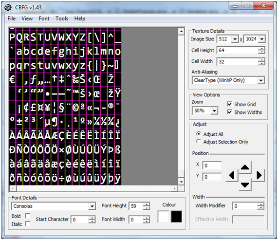
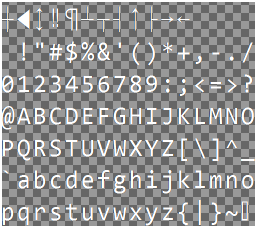
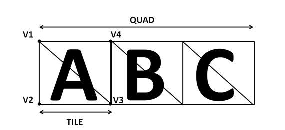
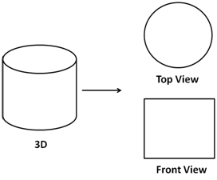
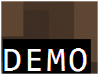
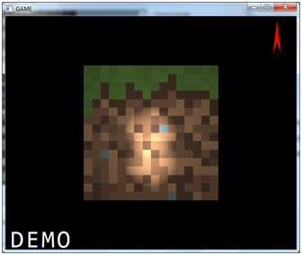
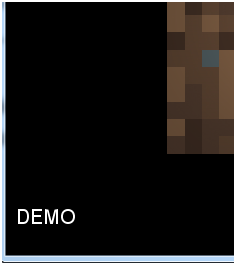

# Game HUD

In this chapter we will create a HUD \(Heads-Up Display\) for our game. That is, a set of 2D shapes and text that are displayed at any time over the 3D scene to show relevant information. We will create a simple HUD that will serve us to show some basic techniques for representing that information.

When you examine the source code for this chpater, you will see also that some little refactoring has been applied to the source code. The changes affect especially the `Renderer` class in order to prepare it for the HUD rendering.

## Text rendering

The first thing that we will do to create a HUD is render text. In order to do that, we are going to map a texture that contains alphabet characters into a quad. That quad will be divided by a set of tiles which will represent a single letter. later on, we will use that texture to draw the text in the screen. So the first step is to create the texture that contains the alphabet. You can use many programs out there that can do this task, such as,  [CBG](http://www.codehead.co.uk/cbfg/), [F2IBuilder](http://sourceforge.net/projects/f2ibuilder/), etc. In this case, We will use Codehead’s Bitmap Font Generator \(CBFG\).

CBG lets you configure many options such as the texture size, the font type, the anti-aliasing to be applied, etc. The following figure depicts the configuration that we will use to generate a texture file. In this chapter we will assume that we will be rendering text encoded in ISO-8859-1 format, if you need to deal with different character sets you will need to tweak a little bit of the code.



When you have finished configuring all the settings in CBG you can export the result to several image formats. In this case we will export it as a BMP file and then transform it to PNG so it can be loaded as a texture. When transforming it to PNG we will set up also the black background as transparent, that is, we will set the black colour to have an alpha value equal to 0 \(You can use tools like GIMP to do that\). At the end you will have something similar as the following picture.



As you can see, the image has all the characters displayed in rows and columns. In this case the image is composed by 15 columns  and 17 rows. By using the character code of a specific letter we can calculate the row and the column that is enclosed in the image. The column can be calculated as follows:  $$column = code \space mod \space numberOfColumns$$. Where $$mod$$ is the module operator. The row can be calculated as follows: $$row = code / numberOfCols$$, in this case we will do a integer by integer operation so we can ignore the decimal part.

We will create a new class named `TextItem` that will construct all the graphical elements needed to render text. This is a simplified version that does not deal with multiline texts, etc. but it will allow us to present textual information in the HUD.  Here you can see the first lines and the constructor of this class.

```java
package org.lwjglb.engine;

import java.nio.charset.Charset;
import java.util.ArrayList;
import java.util.List;
import org.lwjglb.engine.graph.Material;
import org.lwjglb.engine.graph.Mesh;
import org.lwjglb.engine.graph.Texture;

public class TextItem extends GameItem {

    private static final float ZPOS = 0.0f;

    private static final int VERTICES_PER_QUAD = 4;

    private String text;

    private final int numCols;

    private final int numRows;

    public TextItem(String text, String fontFileName, int numCols, int numRows) throws Exception {
        super();
        this.text = text;
        this.numCols = numCols;
        this.numRows = numRows;
        Texture texture = new Texture(fontFileName);
        this.setMesh(buildMesh(texture, numCols, numRows));
    }
```

As you can see this class extends the `GameItem` class, this is because we will be interested in changing the text position in the screen and may also need to scale and rotate it. The constructor receives the text to be displayed and the relevant data of the texture file that will be used to render it \(the file that contains the image and the number of columns and rows\).

In the constructor we load the texture image file and invoke a method that will create a `Mesh` instance that models our text. Let’s examine the `buildMesh` method.

```java
private Mesh buildMesh(Texture texture, int numCols, int numRows) {
    byte[] chars = text.getBytes(Charset.forName("ISO-8859-1"));
    int numChars = chars.length;

    List<Float> positions = new ArrayList();
    List<Float> textCoords = new ArrayList();
    float[] normals   = new float[0];
    List<Integer> indices   = new ArrayList();

    float tileWidth = (float)texture.getWidth() / (float)numCols;
    float tileHeight = (float)texture.getHeight() / (float)numRows;
```

The first lines of code create the data structures that will be used to store the positions, texture coordinates, normals and indices of the Mesh. In this case we will not apply lighting so the normals array will be empty. What we are going to do is construct a quad composed by a set of tiles, each of them representing a single character. We need to assign also the appropriate texture coordinates depending on the character code associated to each tile. The following picture shows the different elements that compose the tiles and the quad.



So, for each character we need to create a tile which is formed by two triangles which can be defined by using four vertices \(V1, V2, V3 and V4\). The indices will be \(0, 1, 2\) for the first triangle \(the lower one\) and \(3, 0, 2\) for the other triangle \(the upper one\).  Texture coordinates are calculated based on the column and the row associated to each character in the texture image. Texture coordinates need to be in the range \[0,1\] so we just need to divide the current row or the current column by the total number of rows or columns to get the coordinate associated to V1. For the rest of vertices we just need to increase the current column or row by one in order to get the appropriate coordinate.

The following loop creates all the vertex position, texture coordinates and indices associated to the quad that contains the text.

```java
for(int i=0; i<numChars; i++) {
    byte currChar = chars[i];
    int col = currChar % numCols;
    int row = currChar / numCols;

    // Build a character tile composed by two triangles

    // Left Top vertex
    positions.add((float)i*tileWidth); // x
    positions.add(0.0f); //y
    positions.add(ZPOS); //z
    textCoords.add((float)col / (float)numCols );
    textCoords.add((float)row / (float)numRows );
    indices.add(i*VERTICES_PER_QUAD);

    // Left Bottom vertex
    positions.add((float)i*tileWidth); // x
    positions.add(tileHeight); //y
    positions.add(ZPOS); //z
    textCoords.add((float)col / (float)numCols );
    textCoords.add((float)(row + 1) / (float)numRows );
    indices.add(i*VERTICES_PER_QUAD + 1);

    // Right Bottom vertex
    positions.add((float)i*tileWidth + tileWidth); // x
    positions.add(tileHeight); //y
    positions.add(ZPOS); //z
    textCoords.add((float)(col + 1)/ (float)numCols );
    textCoords.add((float)(row + 1) / (float)numRows );
    indices.add(i*VERTICES_PER_QUAD + 2);

    // Right Top vertex
    positions.add((float)i*tileWidth + tileWidth); // x
    positions.add(0.0f); //y
    positions.add(ZPOS); //z
    textCoords.add((float)(col + 1)/ (float)numCols );
    textCoords.add((float)row / (float)numRows );
    indices.add(i*VERTICES_PER_QUAD + 3);

    // Add indices por left top and bottom right vertices
    indices.add(i*VERTICES_PER_QUAD);
    indices.add(i*VERTICES_PER_QUAD + 2);
}
```

The are some important things to notice in the previous fragment of code:

* We will represent the vertices using screen coordinates \(remember that the origin of the screen coordinates is located at the top left corner\). The y coordinate of the vertices on top of the triangles is lower than the y coordinate of the vertices on the bottom of the triangles.
* We don’t scale the shape, so each tile is at a x distance equal to a character width. The height of the triangles will be the height of each character. This is because we want to represent the text as similar as possible as the original texture. \(Anyway we can later scale the result since `TextItem` class inherits from `GameItem`\).
* We set a fixed value for the z coordinate, since it will be irrelevant in order to draw this object.

The next figure shows the coordinates of some vertices.


Why do we use screen coordinates ? First of all, because we will be rendering 2D objects in our HUD and often is more handy to use them, and secondly because we will use an orthographic projection in order to draw them. We will explain what is an orthographic projection later on.

The `TextItem` class is completed with other methods to get the text and to change it at run time. Whenever the text is changed, we need to clean up the previous VAOs \(stored in the `Mesh` instance\) and create a new one. We do not need to destroy the texture, so we have created a new method in the `Mesh` class to just remove that data.

```java
public String getText() {
    return text;
}

public void setText(String text) {
    this.text = text;
    Texture texture = this.getMesh().getMaterial().getTexture();
    this.getMesh().deleteBuffers();
    this.setMesh(buildMesh(texture, numCols, numRows));
}
```

Now that we have set up the infrastucture needed to darw  text, How do we do it? The basis is first to render the 3D scene, as in the previous chapters, and then render the 2D HUD over it. In order to render the HUD we will use an orthographic projection \(also named orthogonal projection\). An Orthographic projection is a 2D representation of a 3D object. You may already have seen some samples in blueprints of 3D objects which show the representation of those objects from the top or from some sides. The following picture shows the orthographic projection of a cylinder from the top and from the front.



This projection is very convenient in order to draw 2D objects because it "ignores" the values of the z coordinates, that is, the distance to the view. With this projection the objects sizes do not decrease with the distance \(as in the perspective projection\). In order to project an object using an ortographic projection we will need to use another matrix, the orthographic matrix which formula is shown below.


This matrix also corrects the distortions that otherwise will be generated due to the fact that our window is not always a perfect square but a rectangle. The right and bottom parameters will be the screen size, the left and the top ones will be the origin. The orthographic projection matrix is used to transform screen coordinates to 3D space coordinates. The following picture shows how this mapping is done.


The properties of this matrix, will allow us to use screen coordinates.

We can now continue with thee implementation of the HUD. The next thing that we should do is create another set of shaders, a vertex and a fragment shaders, in order to draw the objects of the HUD. The vertex shader is actually very simple.

```glsl
#version 330

layout (location=0) in vec3 position;
layout (location=1) in vec2 texCoord;
layout (location=2) in vec3 vertexNormal;

out vec2 outTexCoord;

uniform mat4 projModelMatrix;

void main()
{
    gl_Position = projModelMatrix * vec4(position, 1.0);
    outTexCoord = texCoord;
}
```

It will just receive the vertices positions, the texture coordinates, the indices and the normals and will transform them to the 3D space coordinates using a matrix. That matrix is the multiplication of the ortographic projection matrix and the model matrix, $$projModelMatrix  =  ortographicMatrix \cdot modelMatrix$$. Since we are not doing anything with the coordinates in model space, it’s much more efficient to multiply both matrices in java code than in the shadere. By doing so we will be doing that multipliaztion once per item insted of doing it for each vertex. Remember that our vertices should be expressed in screen coordinates.

The fragment shader is also very simple.

```glsl
#version 330

in vec2 outTexCoord;
in vec3 mvPos;
out vec4 fragColor;

uniform sampler2D texture_sampler;
uniform vec4 colour;

void main()
{
    fragColor = colour * texture(texture_sampler, outTexCoord);
}
```

It just uses the texture coordinates and multiples that colour by a base colour. This can be used to change the colour of the text to be rendered without the need of creating several texture files. Now that we have created the new pair of shaders we can use them in the `Renderer` class. But, before that, we will create a new interface named `IHud` that will contain all the elements that are to be displayed in the HUD. This interface will also provide a default `cleanup` method.

```java
package org.lwjglb.engine;

public interface IHud {

    GameItem[] getGameItems();

    default void cleanup() {
        GameItem[] gameItems = getGameItems();
        for (GameItem gameItem : gameItems) {
            gameItem.getMesh().cleanUp();
        }
    }
}
```

By using that interface our different games can define custom HUDs but the rendering mechanism does not need to be changed. Now we can get back to the `Renderer` class, which by the way has been moved to the engine graphics package because now it’s generic enough to not be dependent on the specific implementation of each game. In the `Renderer` class we have added a new method to create, link and set up a new `ShaderProgram` that uses the shaders described above.

```java
private void setupHudShader() throws Exception {
    hudShaderProgram = new ShaderProgram();
    hudShaderProgram.createVertexShader(Utils.loadResource("/shaders/hud_vertex.vs"));
    hudShaderProgram.createFragmentShader(Utils.loadResource("/shaders/hud_fragment.fs"));
    hudShaderProgram.link();

    // Create uniforms for Ortographic-model projection matrix and base colour
    hudShaderProgram.createUniform("projModelMatrix");
    hudShaderProgram.createUniform("colour");
}
```

The `render` method first invokes the method `renderScene` which contains the code from previous chapter that rendered the 3D scene, and a new method, named `renderHud`, to render the HUD.

```java
public void render(Window window, Camera camera, GameItem[] gameItems,
    SceneLight sceneLight, IHud hud) {

    clear();

    if ( window.isResized() ) {
        glViewport(0, 0, window.getWidth(), window.getHeight());
        window.setResized(false);
    }

    renderScene(window, camera, gameItems, sceneLight);

    renderHud(window, hud);
}
```

The `renderHud` method is as follows:

```java
private void renderHud(Window window, IHud hud) {

    hudShaderProgram.bind();

    Matrix4f ortho = transformation.getOrthoProjectionMatrix(0, window.getWidth(), window.getHeight(), 0);
    for (GameItem gameItem : hud.getGameItems()) {
        Mesh mesh = gameItem.getMesh();
        // Set ortohtaphic and model matrix for this HUD item
        Matrix4f projModelMatrix = transformation.getOrtoProjModelMatrix(gameItem, ortho);
        hudShaderProgram.setUniform("projModelMatrix", projModelMatrix);
        hudShaderProgram.setUniform("colour", gameItem.getMesh().getMaterial().getAmbientColour());

        // Render the mesh for this HUD item
        mesh.render();
    }

    hudShaderProgram.unbind();
}
```

The previous fragment of code, iterates over the elements that compose the HUD and multiplies the orthographic projection matrix by  the model matrix associated to each element. The orthographic projection matrix is updated in each `render` call \(because the screen dimensions can change\), and it’s calculated in the following way:

```java
public final Matrix4f getOrthoProjectionMatrix(float left, float right, float bottom, float top) {
    orthoMatrix.identity();
    orthoMatrix.setOrtho2D(left, right, bottom, top);
    return orthoMatrix;
}
```

In our game package we will create a `Hud` class which implements the `IHud` interface and receives a text in the constructor creating internally a `TexItem` instance.

```java
package org.lwjglb.game;

import org.joml.Vector4f;
import org.lwjglb.engine.GameItem;
import org.lwjglb.engine.IHud;
import org.lwjglb.engine.TextItem;

public class Hud implements IHud {

    private static final int FONT_COLS = 15;

    private static final int FONT_ROWS = 17;

    private static final String FONT_TEXTURE = "/textures/font_texture.png";

    private final GameItem[] gameItems;

    private final TextItem statusTextItem;

    public Hud(String statusText) throws Exception {
        this.statusTextItem = new TextItem(statusText, FONT_TEXTURE, FONT_COLS, FONT_ROWS);
        this.statusTextItem.getMesh().getMaterial().setColour(new Vector4f(1, 1, 1, 1));
        gameItems = new GameItem[]{statusTextItem};
    }

    public void setStatusText(String statusText) {
        this.statusTextItem.setText(statusText);
    }

    @Override
    public GameItem[] getGameItems() {
        return gameItems;
    }

    public void updateSize(Window window) {
        this.statusTextItem.setPosition(10f, window.getHeight() - 50f, 0);
    }
}
```

In the `DummyGame` class we create an instance of that class an initialize it with a default text, and we will get something like this.


In the `Texture` class we need to modify the way textures are interpolated to improve text readibility \(you will only notice if you play with the text scaling\).

```java
glTexParameteri(GL_TEXTURE_2D, GL_TEXTURE_MIN_FILTER, GL_NEAREST);
glTexParameteri(GL_TEXTURE_2D, GL_TEXTURE_MAG_FILTER, GL_NEAREST);
```

But the sample is not fnished yet. If you play with the zoom so the text overlaps with the cube you will see this effect.



The text is not drawn with a transparent background. In order to achieve that, we must explicitly enable support for blending so the alpha component can be used. We will do this in the `Window` class when we set up the other initialization parameters with the following fragment of code.

```java
// Support for transparencies
glEnable(GL_BLEND);
glBlendFunc(GL_SRC_ALPHA, GL_ONE_MINUS_SRC_ALPHA);
```

Now you will see the text drawn with a transparent background.


## Complete the HUD

Now that we have rendered a text we can add more elements to the HUD. We will add a compass that rotates depending on the direction the camera is facing. In this case, we will add a new GameItem to the Hud class that will have a mesh that models a compass.


The compass will be modeled by an .obj file but will not have a texture associated, instead it will have just a background colour. So we need to change the fragment shader for the HUD a little bit to detect if we have a texture or not. We will be able to do this by setting a new uniform named `hasTexture`.

```glsl
#version 330

in vec2 outTexCoord;
in vec3 mvPos;
out vec4 fragColor;

uniform sampler2D texture_sampler;
uniform vec4 colour;
uniform int hasTexture;

void main()
{
    if ( hasTexture == 1 )
    {
        fragColor = colour * texture(texture_sampler, outTexCoord);
    }
    else
    {
        fragColor = colour;
    }
}
```

To add the compass the the HUD we just need to create a new `GameItem` instance, tn the `Hud` class, that loads the compass model and adds it to the list of items. In this case we will need to scale up the compass. Remember that it needs to be expressed in screen coordinates, so usually you will need to increase its size.

```java
// Create compass
Mesh mesh = OBJLoader.loadMesh("/models/compass.obj");
Material material = new Material();
material.setAmbientColour(new Vector4f(1, 0, 0, 1));
mesh.setMaterial(material);
compassItem = new GameItem(mesh);
compassItem.setScale(40.0f);
// Rotate to transform it to screen coordinates
compassItem.setRotation(0f, 0f, 180f);

// Create list that holds the items that compose the HUD
gameItems = new GameItem[]{statusTextItem, compassItem};
```

Notice also that, in order for the compass to point upwards we need to rotate 180 degrees since the model will often tend to use OpenGL space  coordinates. If we are expecting screen coordinates it would pointing downwards. The `Hud` class will also provide a method to update the angle of the compass that must take this also into consideration.

```java
public void rotateCompass(float angle) {
    this.compassItem.setRotation(0, 0, 180 + angle);
}
```

In the `DummyGame` class we will update the angle whenever the camera is moved. We need to use the y angle rotation.

```java
// Update camera based on mouse            
if (mouseInput.isRightButtonPressed()) {
    Vector2f rotVec = mouseInput.getDisplVec();
    camera.moveRotation(rotVec.x * MOUSE_SENSITIVITY, rotVec.y * MOUSE_SENSITIVITY, 0);

    // Update HUD compass
    hud.rotateCompass(camera.getRotation().y);
}
```

We will get something like this \(remember that it is only a sample, in a real game you may probably want to use some texture to give the compass a different look\).



## Text rendering revisited

Before reviewing other topics let’s go back to the text rendering approach we have presented here. The solution is very simple and handy to introduce the concepts involved in rendering HUD elements but it presents some problems:

* It does not support non latin character sets.
* If you want to use several fonts you need to create a separate texture file for each font. Also, the only way to change the text size is either to scale it, which may result in a poor quality rendered text, or to generate another texture file.
* The most important one, characters in most of the fonts do not occupy the same size but we are dividing the font texture in equally sized elements.  We have cleverly used “Consolas” font  which is [monospaced](https://en.wikipedia.org/wiki/Monospaced_font) \(that is, all the characters occupy the same amount of horizontal space\), but if you use  a non-monospaced font you will see annoying variable white spaces between the characters. 

We need to change our approach an provide a more flexible way to render text. If you think about it, the overall mechanism is ok, that is, the way of rendering text by texturing quads for each character. The issue here is how we are generating the textures. We need to be able to generate those texture dynamically by using the fonts available in the System.

This is where `java.awt.Font` comes to the rescue, we will generate the textures by drawing each letter for a specified font family and size dynamically. That texture will be used in the same way as described previously, but it will solve perfectly all the issues mentioned above. We will create a new class named `FontTexture` that will receive a Font instance and a charset name and will dynamically create a texture that contains all the available characters. This is the constructor.

```java
public FontTexture(Font font, String charSetName) throws Exception {
    this.font = font;
    this.charSetName = charSetName;
    charMap = new HashMap<>();

    buildTexture();
}
```

The first step is to handle the non latin issue, given a char set and a font we will build a `String` that contains all the characters that can be rendered.

```java
private String getAllAvailableChars(String charsetName) {
    CharsetEncoder ce = Charset.forName(charsetName).newEncoder();
    StringBuilder result = new StringBuilder();
    for (char c = 0; c < Character.MAX_VALUE; c++) {
        if (ce.canEncode(c)) {
            result.append(c);
        }
    }
    return result.toString();
}
```

Let’s now review the method that actually creates the texture, named `buildTexture`.

```java
private void buildTexture() throws Exception {
    // Get the font metrics for each character for the selected font by using image
    BufferedImage img = new BufferedImage(1, 1, BufferedImage.TYPE_INT_ARGB);
    Graphics2D g2D = img.createGraphics();
    g2D.setFont(font);
    FontMetrics fontMetrics = g2D.getFontMetrics();

    String allChars = getAllAvailableChars(charSetName);
    this.width = 0;
    this.height = 0;
    for (char c : allChars.toCharArray()) {
        // Get the size for each character and update global image size
        CharInfo charInfo = new CharInfo(width, fontMetrics.charWidth(c));
        charMap.put(c, charInfo);
        width += charInfo.getWidth();
        height = Math.max(height, fontMetrics.getHeight());
    }
    g2D.dispose();
```

We first obtain the font metrics by creating a temporary image. Then we iterate over the `String` that contains all the available characters and get the width, with the help of the font metrics, of each of them. We store that information on a map, `charMap`, which will use as a key the character. With that process we determine the size of the image that will have the texture \(with a height equal to the maximum size of all the characters and its with equal to the sum of each character width\). `CharSet` is an inner class that holds the information about a character \(its width and where it starts, in the x coordinate, in the texture image\).

```java
    public static class CharInfo {

        private final int startX;

        private final int width;

        public CharInfo(int startX, int width) {
            this.startX = startX;
            this.width = width;
        }

        public int getStartX() {
            return startX;
        }

        public int getWidth() {
            return width;
        }
    }
```

Then we will create an image that will contain all the available characters. In order to do this, we just draw the string over a `BufferedImage`.

```java
    // Create the image associated to the charset
    img = new BufferedImage(width, height, BufferedImage.TYPE_INT_ARGB);
    g2D = img.createGraphics();
    g2D.setRenderingHint(RenderingHints.KEY_ANTIALIASING, RenderingHints.VALUE_ANTIALIAS_ON);
    g2D.setFont(font);
    fontMetrics = g2D.getFontMetrics();
    g2D.setColor(Color.WHITE);
    g2D.drawString(allChars, 0, fontMetrics.getAscent());
    g2D.dispose();
```

We are generating an image which contains all the characters in a single row \(we maybe are not fulfilling  the premise that the texture should have a size of a power of two, but it should work on most modern cards. In any caseyou could always achieve that by adding some extra empty space\). You can even see the image that we are generating, if after that block of code, you put a line like this:

```java
ImageIO.write(img, IMAGE_FORMAT, new java.io.File("Temp.png"));
```

The image will be written to a temporary file. That file will contain a long strip with all the available characters, drawn in white over transparent background using anti aliasing.


Finally, we just need to create a `Texture` instance from that image, we just dump the image bytes using a PNG format \(which is what the `Texture` class expects\).

```java
    // Dump image to a byte buffer
    InputStream is;
    try (
        ByteArrayOutputStream out = new ByteArrayOutputStream()) {
        ImageIO.write(img, IMAGE_FORMAT, out);
        out.flush();
        is = new ByteArrayInputStream(out.toByteArray());
    }

    texture = new Texture(is);
}
```

You may notice that we have modified a little bit the `Texture` class to have another constructor that receives an `InputStream`. Now we just need to change the `TextItem` class to receive a `FontTexture` instance in its constructor.

```java
public TextItem(String text, FontTexture fontTexture) throws Exception {
    super();
    this.text = text;
    this.fontTexture = fontTexture;
    setMesh(buildMesh());
}
```

The `buildMesh` method only needs to be changed a little bit when setting quad and texture coordinates, this is a sample for one of the vertices.

```java
    float startx = 0;
    for(int i=0; i<numChars; i++) {
        FontTexture.CharInfo charInfo = fontTexture.getCharInfo(characters[i]);

        // Build a character tile composed by two triangles

        // Left Top vertex
        positions.add(startx); // x
        positions.add(0.0f); //y
        positions.add(ZPOS); //z
        textCoords.add( (float)charInfo.getStartX() / (float)fontTexture.getWidth());
        textCoords.add(0.0f);
        indices.add(i*VERTICES_PER_QUAD);

      // .. More code
      startx += charInfo.getWidth();
    }
```

You can check the rest of the changes directly in the source code. The following picture shows what you will get for an Arial font with a size of 20:



As you can see the quality of the rendered text has been improved a lot, you can play with different fonts and sizes and check it by your own. There’s still plenty of room for improvement \(like supporting multiline texts, effects, etc.\), but this will be left as an exercise for the reader.

You may also notice that we are still able to apply scaling to the text \(we pass a model view matrix in the shader\). This may not be needed now for text but it may be useful for other HUD elements.

We have set up all the infrastructure needed in order to create a HUD for our games. Now it is just a matter of creating all the elements that represent relevant information to the user and  give them a professional look and feel.

## OSX

If you try to run the samples in this chapter, and the next ones that render text, you may find that the application blocks and nothing is shown in the screen. This is due to the fact that AWT and GLFW do get along very well under OSX. But, what does it have to do with AWT ? We are using the `Font` class, which belongs to AWT, and just by instantiating it, AWT gets initialized also. In OSX AWT tries to run under the main thread, which is also required by GLFW. This is what causes this mess.

In order to be able to use the `Font` class, GLFW must be initialized before AWT and the samples need to be run in headless mode. You need to setup this property before anything gets intialized:

```java
System.setProperty("java.awt.headless", "true");
```

You may get a warning, but the samples will run.

A much more clean approach would be to use the [stb](https://github.com/nothings/stb/) library to render text.

