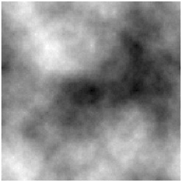
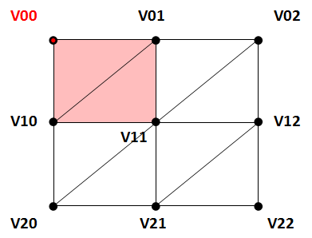
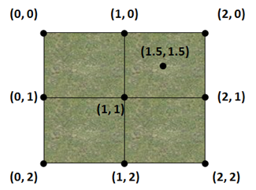
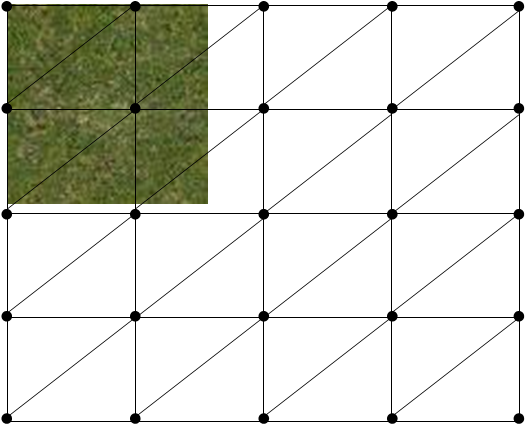
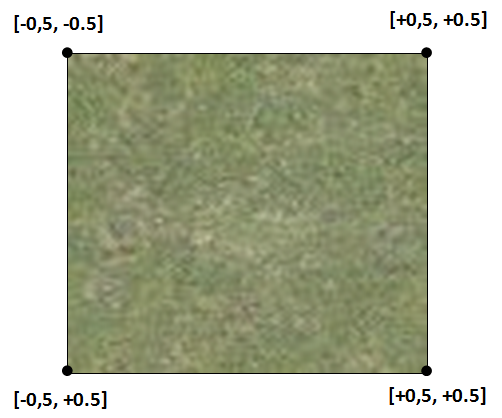
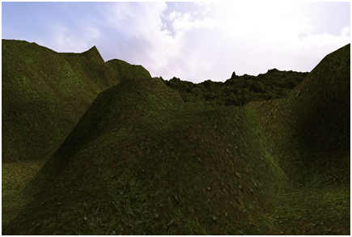

# Height Maps

In this chapter we will learn how to create complex terrains using height maps. Before we start, you will notice that some refactoring has been done. We have created some new packages and moved some of the classes to better organize them. You can check the changes in the source code.

So what’s a height map? A height map is an image which is used to generate a 3D terrain which uses the pixel colours to get surface elevation data. Height maps images use usually gray scale and can be generated by programs like [Terragen](http://planetside.co.uk/). A height map image looks like this.

 

The image above it’s like if you were looking at a fragment of land from above. With that image we will build a mesh composed by triangles formed by vertices. The altitude of each vertex will be calculated depending on the colour of each of the image pixels. Black colour will represent the lowest value and white the highest one. 

We will be creating a grid of vertices, one for each pixel of the image. Those vertices will be used to form triangles that will compose the mesh.

 

That mesh will form a giant quad that will be rendered across x and z axis using the data contained in the height map to change the elevation in the y axis.

 

The process of creating a 3D terrain from a height map will be as follows:
* Load the image that contains the height map. (We will use a ```BufferedImage``` instance to get access to each pixel).
* For each image pixel create a vertex which heights will be based on the pixel colour.
* Assign the correct texture coordinate to the vertex.
* Set up the indices to draw the triangles associated to the vertex.

We will create a class named ```HeightMapMesh``` that will create a ```Mesh``` based on a height map performing the steps described above. Let’s first review the constants defined for that class:

```java
private static final int MAX_COLOUR = 255 * 255 * 255;
```

As we have explained above, we will calculate the height of each vertex based on the colour of each pixel of the image used as height map. Images are usually greyscale, for a PNG image that means that each RGB component for each pixel can vary from 0 to 255, so we have 256 discrete values to define different heights. This may be enough precision for you or not, if it’s not we can use the three RGB components to have more intermediate values, in this case the height can be calculated form a range that gets from 0 to 255^3. In this case, (we will not be limited to use greyscale images).

The next constants are:

```java
private static final float STARTX = -0.5f;

private static final float STARTZ = -0.5f;
```

The mesh will be formed by a set of vertices (one per pixel) which x and z coordinates will be in the range of -0.5 (STARTX) to 0.5 for x axis and -0.5 (STARTZ) to 0.5 for z axis. Later on the resulting mesh can be scaled to accommodate its size in the world. Regarding y axis, we will set up two parameters, minY and maxY, for setting the lowest and highest value that the y coordinate can have. At the end, the terrain will be contained in a cube  in the range [STARTX, -STARTX], [minY, maxY] and [STARTZ, -STARTZ].

The mesh will be created in the constructor of the ```HeightMapMesh``` class, which is defined like this.

```java
public HeightMapMesh(float minY, float maxY, String heightMapFile, String textureFile, int textInc) throws Exception {
```

It receives the minimum and maximum vale for the y axis, the name of the file that contains the image to be used as height map and the texture file to be used. It also receives an integer named ```textInc``` that we will discuss later on.

The first thing that we do in the constructor is to load the height map image into a ```BufferedImage```.

```java
this.minY = minY;
this.maxY = maxY;
        
BufferedImage buffImage = ImageIO.read(getClass().getResourceAsStream(heightMapFile));
int height = buffImage.getHeight();
int width = buffImage.getWidth();
```

Then we load the texture file and setup the variables that we will need to construct the ```Mesh```. The ```incx``` and ```incz``` variables will have the increment to be applied to each vertex in the x and z coordinates so the Mesh covers the range [STARTX, -STARTX] and [STARTZ, -STARTZ].

```java
Texture texture = new Texture(textureFile);

float incx = getWidth() / (width - 1);
float incz = Math.abs(STARTZ * 2) / (height - 1);

List<Float> positions = new ArrayList();
List<Float> textCoords = new ArrayList();
List<Integer> indices = new ArrayList();
```

Then we are ready to iterate over the image, creating a vertex per each pixel, setting its texture coordinates and setting up the indices to define correctly the triangles that compose the ```Mesh```.

```java
for (int row = 0; row < height; row++) {
    for (int col = 0; col < width; col++) {
        // Create vertex for current position
        positions.add(STARTX + col * incx); // x
        positions.add(getHeight(col, row, buffImage)); //y
        positions.add(STARTZ + row * incz); //z

        // Set texture coordinates
        textCoords.add((float) textInc * (float) col / (float) width);
        textCoords.add((float) textInc * (float) row / (float) height);

        // Create indices
        if (col < width - 1 && row < height - 1) {
            int leftTop = row * width + col;
            int leftBottom = (row + 1) * width + col;
            int rightBottom = (row + 1) * width + col + 1;
            int rightTop = row * width + col + 1;

            indices.add(rightTop);
            indices.add(leftBottom);
            indices.add(leftTop);

            indices.add(rightBottom);
            indices.add(leftBottom);
            indices.add(rightTop);
        }
    }
}
```

The process of creating the vertex coordinates is self explanatory, let’s ignore at this moment why we multiply the texture coordinates by a number and how the height is calculated. You can see that for each vertex we define the indices of two triangles except if we are in the last row or column. Let’s review with a 3x3 image to visualize how they are constructed. A 3x3 image contains 9 vertices, and thus 4 quads formed by 2*4 triangles. The following picture  shows that grid, naming each vertex in the form Vrc (r: row, c: column).


 
When we are processing the first vertex (V00), we define the indices of the two triangles shaded in red.

 

When we define the second vertex (V01), ), we define the indices of the two triangles shaded in red, but when we define the third vertex (V02) we do not need to define more indices, the triangles have already been defined. 

 

You can easily see how the process continues for the rest of vertices. Now, once we have created all the vertex positions, the texture coordinates and the indices we just need to create a ```Mesh``` and the associated Material with all that data.

```java
float[] posArr = Utils.listToArray(positions);
int[] indicesArr = indices.stream().mapToInt(i -> i).toArray();
float[] textCoordsArr = Utils.listToArray(textCoords);
float[] normalsArr = calcNormals(posArr, width, height);
this.mesh = new Mesh(posArr, textCoordsArr, normalsArr, indicesArr);
Material material = new Material(texture, 0.0f);
mesh.setMaterial(material);
```

You can see that we calculate the normals taking as an input the vertex positions. Before we see how normals can be calculated, let’s see how heights are obtained. We have created a method named getHeight which calculates the height for a vertex.

```java
private float getHeight(int x, int z, BufferedImage buffImage) {
    float result = 0;
    if (x >= 0 && x < buffImage.getWidth() && z >= 0 && z < buffImage.getHeight()) {
        int rgb = buffImage.getRGB(x, z);
        result = this.minY + Math.abs(this.maxY - this.minY) * ((float) rgb / (float) MAX_COLOUR);
    }
    return result;
}
```

The method receives the x an z coordinates for a pixel, gets the RGB colour (the sum of the individual R, G and B components) and  assigns a value contained between ```minY``` and ```maxY``` (```minY``` for black colour and ```maxY``` for white colour).

Let’s review now how texture coordinates are calculated. The first option is to wrap the texture along the whole mesh, the top left vertex would have  (0, 0) texture coordinates and the bottom right vertex would have (1, 1) texture coordinates. The problem with this approach is that the texture should be huge in order to provide good results, if not, it would be stretched  too much.

But we can still use a small texture with very good results by employing e vary efficient technique that is based that if we set texture coordinates that are beyond (1,1), we get back to origin and start counting again. The following picture shows this behavior.

 

This is what we are doing when calculating the texture coordinates, we are multiplying the texture coordinates (calculated as if the texture just was wrapped covering the whole mesh) by a factor, the ```textInc``` parameter, to increase the number of pixels of the texture to be used between adjacent vertices.

 

The only thing that’s pending is how to calculate normals. Remember that we need normals so light can be applied to the terrain. Without normals our terrain will be rendered with the same colour no matter how light hits each point. The method that we will use here may not be the most efficient for height maps but it will help you understand how normals can be auto-calculated. If you search for other solutions you may find other approaches that only use the heights of adjacent points without performing  cross product operations and are more efficient. Nevertheless since this will only be done at startup, the method resented here will not hurt performance so much.

Let’s graphically explain how the normal will be calculated. Imagine that we have a vertex named $$\vec{P0}$$. We first calculate for each of the surrounding vertices ($$\vec{P1}$$, $$\vec{P02}$$, $$\vec{P3}$$ and $$\vec{P4}$$) the vectors that it’s tangent to the surface that connects those points. These vectors ($$\vec{V1}$$, $$\vec{V2}$$, $$\vec{V3}$$ and $$\vec{V4}$$) are calculated by subtracting each adjacent point from $$\vec{P0}$$ ($$\vec{V1} = \vec{P1}-\vec{P0}$$, etc.) 

 

Then we calculate the normal for each of the planes that connects the adjacent points. This is done by performing the cross product between the previous calculated vector. For instance, the normal of the surface that connects $$\vec{P1}$$ and $$\vec{P2}$$ (shaded in blue) is calculated as the dot product between $$\vec{P1}$$ and $$\vec{P2}$$, $$\vec{V12} = \vec{P1} \times \vec{P2}$$.

 

If we calculate the rest of the normals for the rest of the surfaces ($$\vec{V23} = \vec{V2} \times \vec{V3}$$, $$\vec{V34} = \vec{V3} \times \vec{V4}$$ and $$\vec{V41} = \vec{V4} \times \vec{V1}$$, the normal for $$\vec{P0}$$ will be the sum (normalized) of all the normals of the surrounding surfaces: $$\hat{N0} = \hat{V12} +
 \hat{V23} + \hat{V34} + \hat{V41}$$.


 
The implementation of the method that calculates the normals is as follows.

```java
private float[] calcNormals(float[] posArr, int width, int height) {
    Vector3f v0 = new Vector3f();
    Vector3f v1 = new Vector3f();
    Vector3f v2 = new Vector3f();
    Vector3f v3 = new Vector3f();
    Vector3f v4 = new Vector3f();
    Vector3f v12 = new Vector3f();
    Vector3f v23 = new Vector3f();
    Vector3f v34 = new Vector3f();
    Vector3f v41 = new Vector3f();
    List<Float> normals = new ArrayList<>();
    Vector3f normal = new Vector3f();
    for (int row = 0; row < height; row++) {
        for (int col = 0; col < width; col++) {
            if (row > 0 && row < height -1 && col > 0 && col < width -1) {
                int i0 = row*width*3 + col*3;
                v0.x = posArr[i0];
                v0.y = posArr[i0 + 1];
                v0.z = posArr[i0 + 2];

                int i1 = row*width*3 + (col-1)*3;
                v1.x = posArr[i1];
                v1.y = posArr[i1 + 1];
                v1.z = posArr[i1 + 2];                    
                v1 = v1.sub(v0);

                int i2 = (row+1)*width*3 + col*3;
                v2.x = posArr[i2];
                v2.y = posArr[i2 + 1];
                v2.z = posArr[i2 + 2];
                v2 = v2.sub(v0);

                int i3 = (row)*width*3 + (col+1)*3;
                v3.x = posArr[i3];
                v3.y = posArr[i3 + 1];
                v3.z = posArr[i3 + 2];
                v3 = v3.sub(v0);

                int i4 = (row-1)*width*3 + col*3;
                v4.x = posArr[i4];
                v4.y = posArr[i4 + 1];
                v4.z = posArr[i4 + 2];
                v4 = v4.sub(v0);
                    
                v1.cross(v2, v12);
                v12.normalize();

                v2.cross(v3, v23);
                v23.normalize();
                    
                v3.cross(v4, v34);
                v34.normalize();
                    
                v4.cross(v1, v41);
                v41.normalize();
                    
                normal = v12.add(v23).add(v34).add(v41);
                normal.normalize();
            } else {
                normal.x = 0;
                normal.y = 1;
                normal.z = 0;
            }
            normal.normalize();
            normals.add(normal.x);
            normals.add(normal.y);
            normals.add(normal.z);
        }
    }
    return Utils.listToArray(normals);
}
```
Finally, in order to build larger terrains, we have two options:
* Create a larger height map.
* Reuse a height map and tile it through the 3D space. The height map will be like a terrain block that could be translated across the world like tiles. In order to do so, the pixels of the edge of the height map must be the same (the left edge must be equal to the right side and the top edge must be equal to the bottom one) to avoid gaps between the tiles.

We will use the second approach (and select an appropriate height map). We will create a class named ```Terrain``` that will  create a square of height map tiles, defined like this.

```java
package org.lwjglb.engine.items;

import org.lwjglb.engine.graph.HeightMapMesh;

public class Terrain {

    private final GameItem[] gameItems;

    public Terrain(int blocksPerRow, float scale, float minY, float maxY, String heightMap, String textureFile, int textInc) throws Exception {
        gameItems = new GameItem[blocksPerRow * blocksPerRow];
        HeightMapMesh heightMapMesh = new HeightMapMesh(minY, maxY, heightMap, textureFile, textInc);
        for (int row = 0; row < blocksPerRow; row++) {
            for (int col = 0; col < blocksPerRow; col++) {
                float xDisplacement = (col - ((float) blocksPerRow - 1) / (float) 2) * scale * HeightMapMesh.getXLength();
                float zDisplacement = (row - ((float) blocksPerRow - 1) / (float) 2) * scale * HeightMapMesh.getZLength();

                GameItem terrainBlock = new GameItem(heightMapMesh.getMesh());
                terrainBlock.setScale(scale);
                terrainBlock.setPosition(xDisplacement, 0, zDisplacement);
                gameItems[row * blocksPerRow + col] = terrainBlock;
            }
        }
    }

    public GameItem[] getGameItems() {
        return gameItems;
    }
}
```
We will explain the overall process, we have blocks that have the following coordinates (for x and z and with the constants defined above).



Let's create a terrain formed by a 3x3 grid and that we wont' scale the terrain blocks (taht is, the variable ```blocksPerRow``` will have a 3 and the variable ```scale``` will have a 1). We want the grid to be centered at (0, 0) coordinates.

We need to translate the blocks so the vertices will have the following coordinates.


The translation is done by calling setPosition, buy remember what we set is a displacement not a position. If you review the figure above you will see that the central block does not require any displacement, it's already positioned in the adquate coordinates. The vertex drain in green needs a displacement, for the x coordinate, of $$-1$$ and the vertex drawn in blue needs a displacement of $$+1$$. The formula to calculate the x displacement, taking into consideration the scale and the block width, is this one:

$$xDisplacement=(col - (blocksPerRow -1 ) / 2) \times scale \times width$$

And the equivalent formula for z displacement is:

$$zDisplacement=(row - (blocksPerRow -1 ) / 2) \times scale \times height$$

If we create a Terrain instance in the ```DummyGame``` class, we can get something like this.

 

You can move the camera around the terrain and see how it’s rendered, since we still do not have implemented collision detection you can pass through it and look it from above. Because we have face culling enabled, some parts of the terrain are not rendered when looking from above.