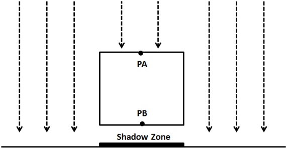
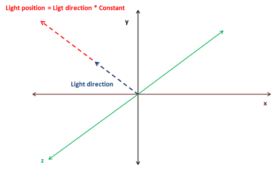
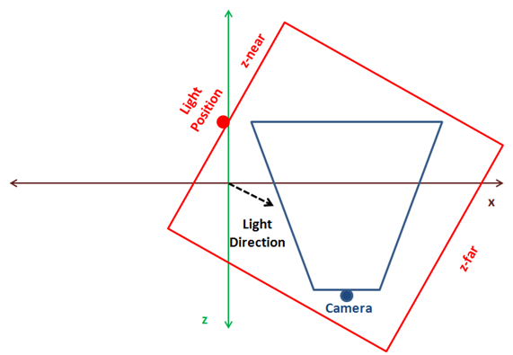
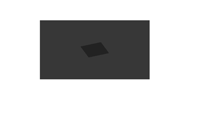

# Shadows

## Shadow Mapping

Currently we are able to represent how light affects the objects in a 3D scene. Objects that get more light are shown brighter then objects that do not receive light. However we are still not able to cast shadows. Shadows will increase the degree of realism that 3D scene would have so we will add support for it in this chapter.

We will use a technique named Shadow mapping which is widely used in games and does not affect severely the engine performance.  Shadow mapping may seem simple to understand but it’s somehow difficult to implement it right, or more precisely it’s very difficult to implement it in a generic ways that cover all the potential cases and produces consistent results.

We will explain here an approach which will serve you to add shadows for most of the cases, but what it’s more important it will serve you to understand its limitations. The code presented here is from from being perfect but I think it will be easy to understand. It is also designed to support directional lights (which in my opinion is the more complex case) but you will learn how it can be extended to support other type of lights (such us point lights). If you want to achieve more advanced results you should use more advance techniques such as Cascaded Shadow Maps. In any case the concepts explained here will serve you as a basis.

So let’s start by thinking in how we could check if a specific area (indeed a fragment) is in shadow or not. While drawing  that area if we could cast rays to the light source, if we can reach the light source without any collision then that pixel is in light. If not, then the pixel is in shadow. 

The following picture shows the case for a point light, PA can reach the source light, but PB and PC can’t so they are in shadow.


So how we can check if we can cast that ray without collisions in an efficient manner?  A light source can , theoretically cast infinitely ray lights, and how do we check if a ray light is blocked or not ? 
What we can do instead is to look at the 3D scene from the light’s point and render the scene from that point. We set the camera at the light position and render the scene so we can store the depth for each fragment, which is equivalent to calculate the distance of each fragment to the light source. We are storing the minimum distance as seen from the light source  as a shadow map.

The following picture shows a cube floating over a plane and  a perpendicular light.

 

The scene as seen from the light perspective would be something like this (the darker the colour, the closer to the light source).


 
With taht information  we can render the 3D scene as usual and check the distance for each fragment to the light source with the minimum stored distance. If the distance is less that the value stored in the shadow map, then the object is in light, otherwise is in shadow. We can have several objects that could be hit by the same ray light. But we store the minimum distance. 

Thus, shadow mapping is a two step process:
* First we render the scene from the light space into a shadow map to get the minimum distances.
* Second we render the scene from the camera point of view and use that depth  map to calculate if objects are in shadow or not.

In order to render the depth map we need to talk about the depth buffer. When we render a scene all the depth information is stored in a buffer named, obviously, depth-buffer (also z-buffer). But. That depth information is the $$z$$ value of each of the fragment that is rendered. If you recall from the first chapters what we are doing while rendering a scene is transforming from world coordinates to screen coordinates, we are drawing in a coordinate space which ranges from $$0$$ to $$1$$ for $$x$$ and $$y$$ values. If an object is more distant than other, we must calculate how this affects their x and y coordinate through the perspective projection matrix- This is not calculated automatically depending on the z value, but that value sets the depth of that fragment.

Besides that, we are also enabling depth testing. In the Window class we have set the following line:

```glsl
glEnable(GL_DEPTH_TEST); 
```

By setting this line we are enabling depth testing, that is, we prevent fragments that cannot be seen, because they are behind other objects, to be drawn Before a fragment is drawn its $$z$$ value is compared with the $$z$$ value of the z-buffer. If it has a higher $$z$$ value (it’s far away) than the $$z$$ value of the buffer it’s discarded. Remember that this is done in screen space, so we are comparing the $$z$$ value of a fragment given a apir of $$x$$ and $$y$$ coordinates in screen space, that is in the range $$[0, 1]$$. The $$z$$ value is also in that range.
The presence of the depth buffer is the reason why to clear the screen before performing any render operation we clear not only the colour but the depth information also.

```java
public void clear() {
    glClear(GL_COLOR_BUFFER_BIT | GL_DEPTH_BUFFER_BIT);
}
```

In order to start building the depth map we want to get that depth information as viewed from the light perspective. We need to setup a camera in the light position, render the scene and store that depth information into a texture so we can access to it later.


Therefore, the first thing we need to do is add support for creating that textures.  We will modify the ```Texture``` class to support the creation of empty textures by adding a new constructor. This constructor expects the dimensions of the texture and the format of the pixels it stores.

```java
public Texture(int width, int height, int pixelFormat) throws Exception {
    this.id = glGenTextures();
    this.width = width;
    this.height = height;
    glBindTexture(GL_TEXTURE_2D, this.id);
    glTexImage2D(GL_TEXTURE_2D, 0, GL_DEPTH_COMPONENT, this.width, this.height, 0, pixelFormat, GL_FLOAT, (ByteBuffer) null);
    glTexParameteri(GL_TEXTURE_2D, GL_TEXTURE_MIN_FILTER, GL_NEAREST);
    glTexParameteri(GL_TEXTURE_2D, GL_TEXTURE_MAG_FILTER, GL_NEAREST);
    glTexParameteri(GL_TEXTURE_2D, GL_TEXTURE_WRAP_S, GL_CLAMP_TO_EDGE);
    glTexParameteri(GL_TEXTURE_2D, GL_TEXTURE_WRAP_T, GL_CLAMP_TO_EDGE);
}
```

We set the texture wrapping mode to ```GL_CLAMP_TO_EDGE``` since we do not want the texture to repeat in case we exceed the $$[0, 1]$$ range.
So now that we are able to create empty textures, we need to be able to render a scene into it. In order to do that we need to use Frame Buffers Objects (or FBOs). A Frame Buffer  is a collection of buffers that can be used as a destination for rendering. When we have been rendering to the screen we have using OpenGL’s default rendering. OpenGL allows us to render to user defined buffers by using FBOs. We will isolate the rest of the code of the process of creating FBOs for shadow mapping by creating a new class named ```ShadowMap```. This is the definition of that class.

```java
package org.lwjglb.engine.graph;

import static org.lwjgl.opengl.GL11.*;
import static org.lwjgl.opengl.GL30.*;

public class ShadowMap {

    public static final int SHADOW_MAP_WIDTH = 1024;

    public static final int SHADOW_MAP_HEIGHT = 1024;

    private final int depthMapFBO;

    private final Texture depthMap;

    public ShadowMap() throws Exception {
        // Create a FBO to render the depth map
        depthMapFBO = glGenFramebuffers();

        // Create the depth map texture
        depthMap = new Texture(SHADOW_MAP_WIDTH, SHADOW_MAP_HEIGHT, GL_DEPTH_COMPONENT);

        // Attach the the depth map texture to the FBO
        glBindFramebuffer(GL_FRAMEBUFFER, depthMapFBO);
        glFramebufferTexture2D(GL_FRAMEBUFFER, GL_DEPTH_ATTACHMENT, GL_TEXTURE_2D, depthMap.getId(), 0);
        // Set only depth
        glDrawBuffer(GL_NONE);
        glReadBuffer(GL_NONE);

        if (glCheckFramebufferStatus(GL_FRAMEBUFFER) != GL_FRAMEBUFFER_COMPLETE) {
            throw new Exception("Could not create FrameBuffer");
        }

        // Unbind
        glBindFramebuffer(GL_FRAMEBUFFER, 0);
    }

    public Texture getDepthMapTexture() {
        return depthMap;
    }

    public int getDepthMapFBO() {
        return depthMapFBO;
    }

    public void cleanup() {
        glDeleteFramebuffers(depthMapFBO);
        depthMap.cleanup();
    }
}
```

The ```ShadowMap``` class defines two constants that determine the size of the texture that will  hold the depth map. It also defines two attributes, one for the FBO and one for the texture. In the constructor, we create a new FBO and a new Texture. We will use a s a pixel format the constant ```GL_DEPTH_COMPONENT``` since we are only interested in storing depth values. Then we attach the FBO to the texture instance.

The following lines explicitly set the FBO to not render any colour. A FBO needs a colour buffer, but we are not going to needed this is why we set the colour buffers to be used as ```GL_NONE```.

```java
glDrawBuffer(GL_NONE);
glReadBuffer(GL_NONE);
```

Now we are ready to render the scene from the light perspective into FBO in the ```Renderer``` class. In order to do that, we will create a specific set of vertex and fragments shaders. 

The vertex shader, named ```depth_vertex.fs```, is defined like this.

```glsl
#version 330

layout (location=0) in vec3 position;
layout (location=1) in vec2 texCoord;
layout (location=2) in vec3 vertexNormal;

uniform mat4 modelLightViewMatrix;
uniform mat4 orthoProjectionMatrix;

void main()
{
    gl_Position = orthoProjectionMatrix * modelLightViewMatrix * vec4(position, 1.0f);
}
```

We expect to receive the same input data as the scene shader. In fact, we only need the position, but to reuse as much as code as possible we will pass it anyway. We also need a pair of matrices. Remember that we must render the scene from the light point of view, so we need to transform our models to light space coordinate. This is done through the ```modelLightViewMatrix``` matrix, which is analogous to view model matrix used for a camera. The light is our camera now. 

Then we need to transform those coordinates to screen space, that is, we need to project them. And this is one of the differences while calculating shadow maps for directional lights versus point lights. For point lights we would use a perspective projection matrix as if we were rendering the scene normally. Directional lights, instead, affect all objects in the same way independently of the distance. Directional lights are located at an infinite point and do not have a position but a direction. An orthographic projection does not render distant objects smaller, and because of this characteristic is the most suitable for directional lights.

The fragment shader is even simpler. It just outputs the $$z$$ coordinate as the depth value.

```glsl
#version 330

void main()
{
    gl_FragDepth = gl_FragCoord.z;
}
```

In fact, you can remove that line, since we are only generating depth values, the depth value it will be automatically returned.

Once we have defined the new shaders for depth rendering we can use them in the ```Renderer``` class. We define a new method for setting up those shaders, named ```setupDepthShader```, whichi will be invoked where the others shaders are initialized.

```java
private void setupDepthShader() throws Exception {
    depthShaderProgram = new ShaderProgram();
    depthShaderProgram.createVertexShader(Utils.loadResource("/shaders/depth_vertex.vs"));
    depthShaderProgram.createFragmentShader(Utils.loadResource("/shaders/depth_fragment.fs"));
    depthShaderProgram.link();

    depthShaderProgram.createUniform("orthoProjectionMatrix");
    depthShaderProgram.createUniform("modelLightViewMatrix");
}
```

Now we need to create a new method that uses those shaders which will be named ```renderDepthMap```. This method will be invoked in the principal render method.

```java
public void render(Window window, Camera camera, Scene scene, IHud hud) {
    clear();

    // Render depth map before view ports has been set up
    renderDepthMap(window, camera, scene);

    glViewport(0, 0, window.getWidth(), window.getHeight());

	// Rest of the code here ....
	
```

 If you look at the code you will see that the new method is invoked at the very beginning before we have set the view port. This is due to the fact that this new method will change the view port to match the dimensions of the texture that holds the depth map. Because of that, we will always need to set, after the ```renderDepthMap``` has been finished, the view port to the screen dimensions (without checking if the window has been resized).
 
Let’s define now the ```renderDepthMap``` method. The first thing that we will do is to bind to the FBO we have created in the ```ShadowMap``` class and set the view port to match the texture dimensions.

```java
glBindFramebuffer(GL_FRAMEBUFFER, shadowMap.getDepthMapFBO());
glViewport(0, 0, ShadowMap.SHADOW_MAP_WIDTH, ShadowMap.SHADOW_MAP_HEIGHT);
```
 
Then we clear the depth buffer contents and bind the depth shaders. Since we are only dealing with depth values we do not need to clear colour information.

```java
glClear(GL_DEPTH_BUFFER_BIT);

depthShaderProgram.bind();
```

Now we need to setup the matrices, and here comes part of the tricky part. We use the light as a camera so we need to create a view matrix which needs a position and three angles. As it has been said at the beginning of the chapter we will support  only directional lights, and that type of lights does not define a position but a direction. If we were using point lights this would be easy, the position of the light would be the position of the view matrix, but we do not have that.

We will take a simple approach to calculate the light position. Directional lights are defined by a vector, usually, normalized, which points to the direction where the light is. We will multiply that direction vector by a configurable factor so it defines a point at a reasonable distance for the scene we want to draw. We will use that direction in order to calculate the rotation angle for that view matrix.

 

This is the fragment that calculates the light position and the rotation angles

```java
float lightAngleX = (float)Math.toDegrees(Math.acos(lightDirection.z));
float lightAngleY = (float)Math.toDegrees(Math.asin(lightDirection.x));
float lightAngleZ = 0;
Matrix4f lightViewMatrix = transformation.updateLightViewMatrix(new Vector3f(lightDirection).mul(light.getShadowPosMult()), new Vector3f(lightAngleX, lightAngleY, lightAngleZ));
```

Next we need to calculate the orthographic projection matrix.

```java
Matrix4f orthoProjMatrix = transformation.updateOrthoProjectionMatrix(orthCoords.left, orthCoords.right, orthCoords.bottom, orthCoords.top, orthCoords.near, orthCoords.far);
```

We have modified the Transformation class to include the light view matrix and the orthographic projection matrix. Previously we had a orthographic 2D projection matrix, so we have renamed the previous methods and attributes. You can check the definition in the source code which is straight forward.

Then we render the scene  objects as in the ```renderScene``` method but using the previous matrices to work in light space coordinate system.

```java
depthShaderProgram.setUniform("orthoProjectionMatrix", orthoProjMatrix);
Map<Mesh, List<GameItem>> mapMeshes = scene.getGameMeshes();
for (Mesh mesh : mapMeshes.keySet()) {
    mesh.renderList(mapMeshes.get(mesh), (GameItem gameItem) -> {
        Matrix4f modelLightViewMatrix = transformation.buildModelViewMatrix(gameItem, lightViewMatrix);
        depthShaderProgram.setUniform("modelLightViewMatrix", modelLightViewMatrix);
    }
    );
}

// Unbind
depthShaderProgram.unbind();
glBindFramebuffer(GL_FRAMEBUFFER, 0);
```

The parameterization of the orthographic projection matrix is defined in the directional Light. Think of the orthographic projection matrix as a bounding box that contains all the objects that we want to render. When projection we transform form light space coordinates space to coordinates in the range $$[-1, 1]$$, only the objects that fit into that bounding box will be inside that range, and thus, be visible. That bounding box is defined by 6  parameters:  left, right, bottom, top, near, far. Since, the light position is now the origin, these parameters define the distance form that origin to the left or right (x-axis) up or down (y-axis) and to the nearest or farthest plane (z-axis).  

One of the trickiest points in  getting shadows map to work is determine the light position and the orthographic projection matrix parameters. This is way all these parameters are now defined in the ```DirectionalLight``` class so it can be set properly according to each scene.

You can implement a more automatic approach, by calculating the centre of the camera frustum, get back in the light direction and build a orthographic projection that contains all the objects in the scene.  The following figure shows a 3D scene as looked form above, the camera position and its frustum (in blue) and the optimal light position and bounding box in red. 
 


The problem with the approach above is that is difficult to calculate and if you have small objects and the bounding box is big you may get strange results. The approach presented here is simpler for small scenes and you can tweak it to match your models (even you can chose to explicitly set light’s position to avoid strange effects if camera moves far away from the origin). If you want a more generic model that can be applied to any scene you should extend it to support cascading shadow maps.

Let's continue, but before we use the depth maps to actually calculate shadows, you could render a quad with the generated texture to see how  a real depth map looks like. You could get something like this for a scene composed by a rotating cube floating over a plane with a perpendicular directional light.


 
The darker the colour, the closest to the light position. What’s the effect of the light position in the depth map ? You can play with the multiplication factor of the directional light and you will see that the size of the objects rendered in the texture do not decrease. Remember that we are using an orthographic projection matrix and objects do not get smaller with distance. What you will see is that all colours get brighter as seen in the next picture.
 
Does that mean that we can choose a high distance for the light position without consequences ? The answer is not, if light is too far away from the objects we want to render, these objects can be out of the bounding box that defines the orthographic projection matrix. In this case you will get a nice white texture which would be useless for shadow mapping. Ok, then we simply increase the bounding box size and everything will be ok, right ? The answer is again not. If you chose huge dimensions for the orthographic projection matrix your objects will be drawn very small in the texture, and the depth values can even overlap leading to strange results.  Ok, so you can think in increasing the texture size, but, again in this case you are limited and textures cannot grow indefinitely to use huge bounding boxes.
So as you can see selecting the light position and the orthographic projection parameters is a complex equilibrium which makes difficult to get right results using shadow mapping.

Let’s go back to our rendering process, once we have calculated the depth map we can use it while rendering the scene. First we need to modify the scene vertex shader. Up to now, the vertex shader  projected the vertex coordinates from model view space to the  using a perspective matrix. Now we need to project also the vertex coordinates form light space coordinates using a projection matrix to be used in the fragment shader to calculate the shadows.
The vertex shader is modified like this.
#version 330

layout (location=0) in vec3 position;
layout (location=1) in vec2 texCoord;
layout (location=2) in vec3 vertexNormal;

out vec2 outTexCoord;
out vec3 mvVertexNormal;
out vec3 mvVertexPos;
out vec4 mlightviewVertexPos;
out mat4 outModelViewMatrix;

uniform mat4 modelViewMatrix;
uniform mat4 projectionMatrix;
uniform mat4 modelLightViewMatrix;
uniform mat4 orthoProjectionMatrix;

void main()
{
    vec4 mvPos = modelViewMatrix * vec4(position, 1.0);
    gl_Position = projectionMatrix * mvPos;
    outTexCoord = texCoord;
    mvVertexNormal = normalize(modelViewMatrix * vec4(vertexNormal, 0.0)).xyz;
    mvVertexPos = mvPos.xyz;
    mlightviewVertexPos = orthoProjectionMatrix * modelLightViewMatrix * vec4(position, 1.0);
    outModelViewMatrix = modelViewMatrix;
}

 We use new uniforms for the light view matrix and the orthographic projection matrix.
In the fragment shader we will create a new function to calculate the shadows that is defined like this.
float calcShadow(vec4 position)
{
    float shadowFactor = 1.0;
    vec3 projCoords = position.xyz;
    // Transform from screen coordinates to texture coordinates
    projCoords = projCoords * 0.5 + 0.5;
    if ( projCoords.z < texture(shadowMap, projCoords.xy).r ) 
    {
        // Current fragment is not in shade
        shadowFactor = 0;
    }

    return 1 - shadowFactor;
}

The function receives the position in light view space projected using the orthographic projection matrix. It returns 0 if the position is in shadow and 1 if it’s not. First, the coordinates are transformed to texture coordinates. Screen coordinates are in the range [-1, 1], but texture coordinates are in the range [0, 1]. With that coordinates we get the depth value from the texture and compare it with the z value of the fragment coordinates. If the z value if the fragment has a lower value than the one stored in the texture that means that the fragment is not in shade.
In the fragment shader, the return value from the calcShadow function to modulate the light colour contributions from point, spot and directional lights. The ambient light is not affected by the shadow.
float shadow = calcShadow(mlightviewVertexPos);    
fragColor = baseColour * ( vec4(ambientLight, 1.0) + totalLight * shadow );

In the renderScene method of the Renderer class we just need to pass the uniform for the orthographic projection and light view matrices (we need to modify also the method that initializes the shader to create the new uniforms). You can consult this in the book’s source code. If to run the DummyGame class, which has been modified to setup a floating cube over a plane with a directional light which angle can be changed by using up and down keys, you should see something like this.
 

Although shadows are working (you can check that by moving light direction), the implementation presents some problems. First of all, there are strange lines in the objects that are lightened up, this effect is called shadow acne, and it’s produced by the limited resolution of the texture that stores the depth map. The second problem is that the borders of the shadow are not smooth and look blocky. The cause is the same again, the texture resolution. We will solve these problems in order to improve shadow quality.


