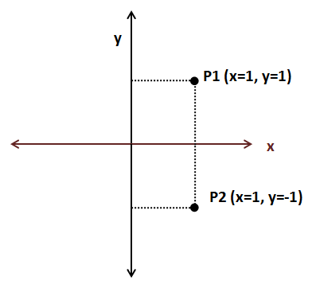
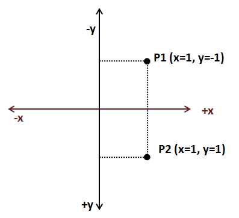

# A brief about coordinates

In this chapter we will talk a little bit about coordinates and coordinates systems trying to introduce some fundamental mathematical concepts in a simple way to support the techniques and topics that we will address in subsequent chapters. We will assume some simplifications which may sacrifice preciseness for the sake of legibility.

We locate objects in space by specifying its coordinates. Think about a map, you specify a point in a map by stating its latitude or longitude, with just a pair of numbers a point is precisely identified. That pair of numbers are the point coordinates (things are a  little bit more complex in reality, since a map is a projection of a non perfect ellipsoid, the earth, so more data is needed but it’s a good analogy).

A coordinate system is a system which employs one or more numbers, that is, one or more coordinates to uniquely specify the position of a point. There are different coordinate systems (Cartesian, polar, etc.) and you can transform coordinates from one system to another. We will use the Cartesian coordinate system.

In the Cartesian coordinate system, for two dimensions, a coordinate is defined by two numbers that measure the signed distance to two perpendicular axis, x and y.

 

Continuing with the map analogy, coordinate systems define an origin. For geographic coordinates the origin is set in the point where the equator and the zero meridian cross. Depending on where we set the origin coordinates for a specific point  are different. A coordinate system may also define the orientation of the axis. In the previous figure, x coordinates increase as long as we move to the right and y coordinates increase as we move upwards. But, we could also define an alternative Cartesian coordinate system with different axis orientation in which we would obtain different coordinates.
 

As you can see we need to define some arbitrary parameters, such as the origin and the axis orientation in order to give the appropriate meaning to the pair of numbers that constitute a coordinate.  We will refer to that coordinate system with the set of arbitrary parameters as the coordinate space. In order to work with a set of coordinates we must use the same coordinate space.  The good news are that we can transforms coordinates from one space to another just by performing translations and rotations.

If we are dealing with 3D coordinates we need an additional axis, the z axis. 3D coordinates will be formed by a set of three numbers (x, y, z). 
 

As in 2D Cartesian coordinate spaces we can change the orientation of the axis in 3D coordinate spaces as long as the axis are perpendicular. The next figure shows another 3D coordinate space.
 

3D coordinates can be classified in two types: left handed and right handed. How do you know which type it is ? Take your hand and form a “L” between your thumb and your index fingers, the middle finger should point in a direction perpendicular to the other two. The thumb should point to the direction where the x axis increases, the index finger should point where the y axis increases and the middle finger should point where the z axis increases. If you are able to do that with your left hand, then its left handed, if you need to use your right hand is right-handed.

 

2D coordinate spaces are all equivalent since by applying rotation we can transform from one to another. 3D coordinate spaces, on the contrary, are not all equal, you can only transform from one to another by applying rotation if they both have the same handedness, that is, if both are left handed or right handed.

Now that we have define some basic topics let’s talk about some common used terms that are used when dealing with 3D graphics. When we explain in later chapters how to render 3D models we will see that we use different 3D coordinate spaces, that is because each of those coordinate spaces have a context,  a purpose. A set of coordinates are meaningless unless they are referred to something. When you examine this coordinates (40.438031, -3.676626) they may say something to you or not, but if I say that they are geometric coordinates (latitude and longitude) you will see that they are the coordinates of place in Madrid.

When we will load 3D objects we will get a set of 3D coordinates, those coordinates are expressed in a 3D coordinate space which is called object coordinate space. When the graphics designers are creating those 3D models they don’t know anything about the 3D scene that this model will be displayed, so they can only the define the coordinates using a coordinate space that is only relevant for the model.

When we will be drawing a 3D scene we will refer all of our 3D objects to the so called world space coordinate space. We will need to transform from 3D object coordinate spaces coordinates to world space coordinates. Some objects will need to be rotated, stretched or enlarged and translated in order to be displayed properly in a 3D scene.

We will also need to restrict the range of the 3D space that is shown, which is like moving a camera through our 3D space. Then we will need to transform world space coordinates to camera or view space coordinates. Finally these coordinates need to be transformed to screen coordinates, which are 2D, so we need to project 3D view coordinates to a 2D screen coordinate space.

The following picture shows OpenGL coordinates, (the z axis is perpendicular to the screen) and coordinates are between -1 and +1.

 

Don’t worry if you don’t have clear all the concepts, they will be revisited during next chapters with practical examples. 

